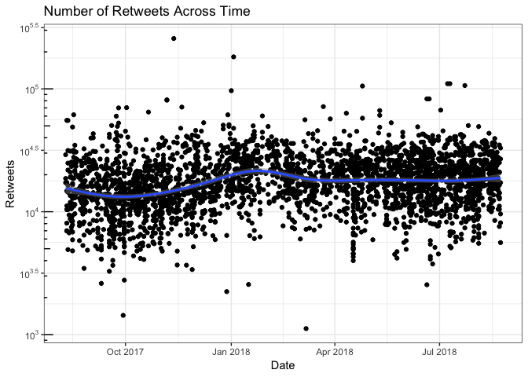

README
================

This repo contains data sets that students can use to practice wrangling
data.

It contains:

  - `trump-tweets.csv`: Donald Trump’s last 3,200 tweets (as of
    2019-08-23).

In order for the code that collects the data to work (i.e.,
`trump-tweets.R`), you must create a developer app and authenticate via
access tokens. See Steps 1 and 2b from the rtweet
[tutorial](https://rtweet.info).

``` r
# load packages
library(tidyverse)
library(lubridate)

# load data
df_raw <- read_csv("trump-tweets.csv")

# wrangle data
df <- df_raw %>% 
  mutate(date = date(created_at),
         retweets = retweet_count) %>%
  select(date, retweets) 
  
# plot data
ggplot(df, aes(x = date, y = retweets)) + 
  geom_point() + 
   scale_y_log10(breaks = scales::trans_breaks("log10", function(x) 10^x),
                 labels = scales::trans_format("log10", scales::math_format(10^.x))) +
  annotation_logticks(sides = "l") +
  geom_smooth() + 
  theme_bw() +  
  labs(x = "Date",
       y = "Retweets",
       title = "Number of Retweets Across Time")
```

<!-- -->
